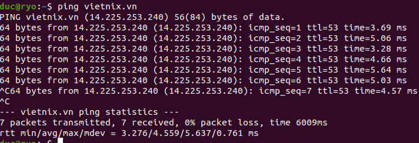

# Topic2-LinuxCommands-InternetFundamentals

#Linux Command Line

- Ping vietnix.vn và giải thích kết quả lệnh `ping` và `hping3`.
  
  - `ttl=` là gì trong ping?
    - ttl: laf
  - `time=` là gì trong ping?

- SSH Command:
  - Kết nối bằng password.
  - Kết nối bằng key.
  - Kết nối bằng port custom.

- SCP Command:
  - Copy 1 file.
  - Copy 1 folder.

- Rsync Command:
  - Copy file.
  - Copy folder.
  - `rsync incremental`.

- Cat Command:
  - Xem nội dung 1 file.
  - Xem dòng thứ `<n>` trong file.
  - Ghi nhiều dòng vào 1 file bằng EOF.

- Echo Command:
  - Chèn thêm 1 dòng vào cuối file.
  - Overwrite nội dung file.

- Tail/Head Command:
  - Sự khác biệt giữa `tail` và `head`.
  - Sự khác biệt giữa `tail` và `tailf`.

- Sed Command:
  - Find and replace string trong file.

- Traceroute/Tracert Command:
  - Thực hiện và giải thích kết quả.

- Netstat Command:
  - Hiển thị các socket đang listen.
  - Không resolve hostname.
  - Không resolve portname.
  - Display process name/PID.
  - Chỉ hiển thị socket TCP.
  - Chỉ hiển thị socket UDP.

- Sort Command:
  - Theo thứ tự tăng dần.
  - Theo thứ tự giảm dần.
  - Theo column.

- Uniq Command:
  - Lọc các dòng lặp lại.
  - Lọc và đếm số lượng dòng lặp lại.

- Wc Command:
  - Đếm số dòng.
  - Đếm số ký tự.

- Chmod, Chown, Chattr Command:
  - Phân quyền bằng số và chữ.
  - Đổi owner user/group.
  - Set Immutable Attribute.

- Find Command:
  - Tìm file đuôi `.log`.
  - Tìm folder tên `abc`.
  - Tìm file tên `abc`.
  - Tìm file `abc` và đặt quyền read only.

- Cp Command:
  - Copy file.
  - Copy folder.

- Mv Command:
  - Di chuyển/đổi tên file/folder.

- Cut Command:
  - Lấy ký tự thứ `<n>`.
  - Lấy từ ký tự `<n>` trở về sau.
  - Lấy đến ký tự thứ `<n>`.

- Dig Command:
  - Kiểm tra record A, MX, NS.
  - Kiểm tra record A, MX, NS với custom DNS.

- Tar/Zip/Unzip Command:
  - Nén/giải nén `tar.gz`.
  - Nén/giải nén `.zip`.

- Mount/Umount Command:
  - Thêm ổ cứng `sdb` ~ 5gb.
  - Kiểm tra số lượng ổ cứng.
  - Mount vào `/mnt/test`.
  - Umount `/mnt/test`.

- Symbolic Links, Hard Links Command:
  - Định nghĩa Sym Link.
  - Định nghĩa Hard Link.
  - Ví dụ về Sym Link và Hard Link.

- Ls Command:
  - Liệt kê file/thư mục.
  - Liệt kê file/thư mục và thuộc tính.
  - Show file ẩn.

- Ps Command:
  - Show tiến trình.
  - Kill tiến trình.

- Top Command:
  - Kiểm tra tài nguyên CPU.
  - Giải thích các thông số.

- Free Command:
  - Giải thích các thông số về RAM.

- Df Command:
  - Xem dung lượng disk.
  - Phân vùng `/` là gì.
