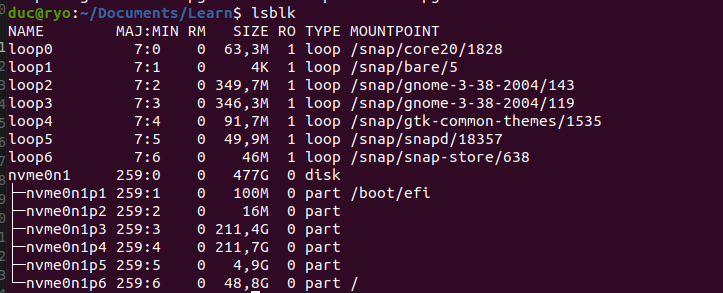
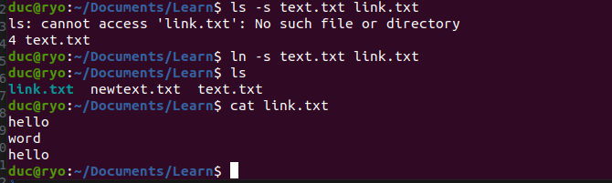
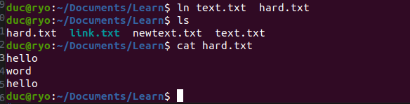
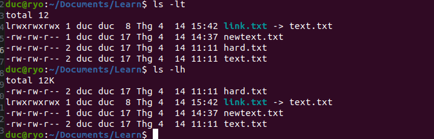
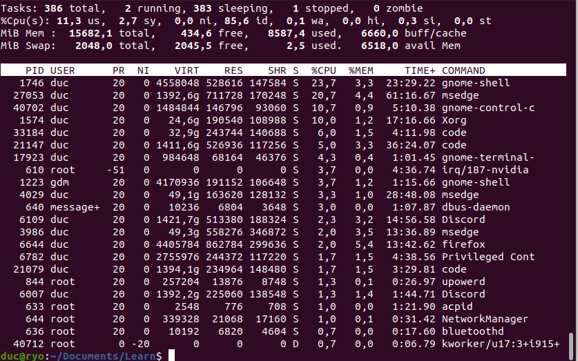

# Topic2-LinuxCommands-InternetFundamentals

## Executive Summary

Tài liệu này tổng hợp các kiến thức cốt lõi về quản trị hệ thống Linux và hạ tầng Internet. Mục tiêu nhằm cung cấp cho Software Engineer các kỹ năng thao tác dòng lệnh (CLI), quản lý tệp tin, cấu hình mạng, bảo mật SSL/TLS và hiểu rõ cơ chế phân giải tên miền (DNS).

## Table of Contents

1. Network Connectivity (Ping, Hping3, Traceroute)

2. Remote Access & Data Transfer (SSH, SCP, Rsync)

3. File Manipulation (Cat, Echo, Tail/Head, Sed)

4. Network Statistics & Diagnostics (Netstat, Dig)

5. System Administration (Chmod, Find, Mount, Ps, Top)

6. Security & SSL/TLS Fundamentals

7. Domain, DNS & Mail Server Infrastructure

#Linux Command Line

- Ping vietnix.vn và giải thích kết quả lệnh `ping` và `hping3`.
  
  - `ttl=` là gì trong ping?
    - ttl (Time To Live): Số lượng hop (bước nhảy router) tối đa mà gói tin có thể đi qua trước khi bị hủy
  - `time=` là gì trong ping?
    - tine: Là thời gian phản hồi

  
  - `Hping3`: Dùng để kiểm tra kết nối qua các port TCP/UDP cụ thể
    - Gửi 4 gói TCP SYN đến server tại port 80
    - Mục đích: Kiểm tra mạng, Kiểm tra port(TCP/UDP), Mô phỏng tấn công, Kiểm tra Firewall

- SSH Command:
  - Kết nối bằng password: `ssh user@ip_address`
    - Cách hoạt động: Client gửi username, Server yêu cầu password, nếu đúng cho login
    - Nhược điểm: Dễ bị brute-force (Phương pháp thử tất cả khả năng)
  - Kết nối bằng key: `ssh -i key.pem user@ip_address`
    - Các bước: Tạo key (ssh-keygen) tạo ra 2 file id_rsa và id_rsa.pub, Copy key lên server (ssh-copy-id username@ip), kết nối không cần nhập mật khẩu (ssh username@ip)
  - Kết nối bằng port custom: `ssh -p 2222 user@ip_address`
    - Trong file config đổi port SSH (sudo nano /etc/ssh/sshd_config)

- SCP Command:
  - Copy 1 file.
    - (scp file.txt username@ip:/path/) (Ví dụ: scp text.txt duc@192.168.1.10:/home/duc/)-> Copy từ máy lên server
    - (scp username@ip:/path/file.txt .) -> copy file tu server về máy
  - Copy 1 folder.
    - Dùng thêm -r (Recursive)
      - Local - Server : scp -r project/ duc@192.168.1.10:/home/duc/
      - Server - Local : scp -r duc@192.168.1.10:/home/duc/project
- Rsync Command:
  - Copy file.
    - (rsyn file.txt username@ip:/path/)
  - Copy folder.
    - (rsync -a folder/ username@ip:/path/) (-a: Copy đệ quy, Giữ quyền file, Giữ timestamp, Giữ cấu trúc thư mục)
  - `rsync incremental`.
    - Chỉ lấy phân thay đổi, nhanh tiết kiệm băng thông

- Cat Command:

  
  - Xem nội dung 1 file.
    - cat file.txt
  - Xem dòng thứ `<n>` trong file.
  - Ghi nhiều dòng vào 1 file bằng EOF.
    - cat <<EOF> file.txt
      hello
      word
      EOF

- Echo Command:
  - Chèn thêm 1 dòng vào cuối file.
    - cat <<EOF>> file.txt || echo "hello" >> file.txt (>>)
  - Overwrite nội dung file.
    - cat <<EOF> file.txt || echo "hello" > file.txt (>)
  - So sánh Echo và EOF
    - Echo: Ghi một dòng
    - EOF: Ghi nhiều dòng

- Tail/Head Command:

  
  - Sự khác biệt giữa `tail` và `head`.
    - tail file.txt: xem cuối file (Mặc định 10 dòng)
      - tail -n 5 file.txt (Xem 5 dòng cuối)
    - head file.txt: xem đầu file
      - head -n 5 file.txt (Xem 5 dòng đầu)
    - tail -f log.txt: realtime
  - Sự khác biệt giữa `tail` và `tailf`.

- Sed Command:
  - Find and replace string trong file.
    
    - sed 's/old/new' file.txt
      - s = substitute (Thay thế)
  - Thay thế trong từng dòng (Chỉ thay lần đầu xuất hiện trong mỗi dòng)
    - sed 's/hello/world' file.txt
  - Thay tất cả trong dòng
    - sed 's/hello/world/g' file.txt
  - Replace chỉ dòng cụ thể
    - (sed '2s/hello/world' file.txt): chỉ thay ở dòng 2
  - Replace nhiều file
    - (sed -i 's/old/new/g' \*.txt)

  Ký hiệu Nghĩa
  s substitute (replace)
  d delete
  p print
  a append (sau dòng)
  i insert (trước dòng)
  c change (thay dòng)
  -i sửa file trực tiếp

  
  - Ghi đè file, không có -i thì chỉ in ra
    - (sed -i 's/old/new/g' file)

- Traceroute/Tracert Command: Theo dõi đường đi của gói tin từ máy đến server (qua các router trung gian)
  - Thực hiện và giải thích kết quả.
    
    - Cột đầu tiên số hop, cột 2 IP router, 3 cột tiếp theo: thời gian phản hồi (3 lần đo)
    - Hop 2-4: Mạng ISP nội bộ, NAT + routing của nhà mạng
    - Hop 5-9: hạ tầng core mạng, các router lớn của ISP, chuyển tiepes traffic quốc gia
    - Hop 10: Server Vietnix

- Netstat Command: Kiểm tra các kết nối mạng đang hoạt động, Kiểm tra các port đang lắng nghe,Thống kê lưu lượng và giao thức, Hiển thị bảng định tuyến
  - Hiển thị các socket đang listen.
    
    - 0.0.0.0:\* : Cho phép mọi IP kết nối
    - localhost:domain : DNS server local (Port 53)
    - mDNS (Multicast DNS): dùng để tìm thiết bị trong LAN (AirPlay,printer,...)
    - UNIX sockkets: Giao tiếp nội bộ trong Linux

  - Không resolve hostname: Bình thường nếu không có -n, máy tính sẻ thực hiện một truy vấn DNS để xem địa chỉ IP đó thuộc về tên miền nào
    - netstat -n

  - Không resolve portname: Hệ điều hành có file thường là /etc/services để tra cứu tên của các công này, nếu không có Resolve nó sẻ giữ nguyên :80 :443

  - Display process name/PID.
    
    - Có thêm cột PID/Program name: cho biết ai lầ chủ nhân của dòng đso

  - Chỉ hiển thị socket TCP (HTTP, SSH, HTTPS)
    
    - Local Address: các con số sau dấu: (như 51478) là các Ephemeral Ports (cổng tạm thời). Khi mở một trang web, máy tính tự động chọn một số cổng ngẫu nhiên trong dải số cao để gửi yêu cầu đi

  - Chỉ hiển thị socket UDP (DNS, DHCP, HTTPS)
    
    - Tại sao lại có 443 (TCP). Các dòng IP như 104.18.32.47:443 (google) đang dùng giao thức QUIC chạy trên nền UDP để giúp lướt web nhanh hơn, giảm độ trẽ so với TCP truyền thống.
    - (0 ryo:bootpc \_gateway:bootps ): Đây là giao thức DHCP. Máy tính đang nói chuyện với Router(\_gateway:bootps) để xin cấp phát hoặc duy trì địa chỉ IP nội bộ .

- Sort Command:
  - Theo thứ tự tăng dần.

    
    - sort file.txt: Sắp xếp tăng dần (ascending)

  - Theo thứ tự giảm dần.
    - sort -r file.txt (-r = reserve)

  - Theo column.
    - sort -k2 file.txt
    - sort -k2 -r file.txt
    - sort -k1,1 -k2,2 file.txt (sort theo cột 1 trước nếu giống thì sort theo cột 2)

- Uniq Command:
  - Lọc các dòng lặp lại (hoạt động tốt khi dữ liệu đã được sort trước)
    
    - Vì chỉ xóa các dòng lặp lại liền kề nên cần short trước
  - Lọc và đếm số lượng dòng lặp lại.
    
  - (-d): Chỉ hiện dòng trùng

    

  - (-u): Chỉ hiện dòng không trùng

    

- Wc Command:

  
  - Đếm số dòng: wc -l file.txt
  - Đếm số ký tự: wc -m file.txt (bao gồm khoảng trắng + xuống dòng)
  - Đếm số từ: wc -w file.txt

- Chmod, Chown, Chattr Command:
  - Phân quyền bằng số và chữ. - chmod 755 file # phân quyền số(4:read, 2:write, 1: excute) - chmod u+x file # phân quyền chữ
    Ký hiệu Nghĩa
    u user (owner)
    g group
    o others
    (+) thêm quyền
    (-) xóa quyền
    (=) gán quyền
    - Ví dụ: chmod g-w file.txt: bỏ quyền write của group
- Đổi owner user/group.
  - chown user:group file # đổi owner
- Set Immutable Attribute.
  - chattr +i file # immutable (không sửa/xóa được)
  - Gỡ immutable: chattr -i file.txt

- Find Command: Tìm file/folder theo điều kiện + có thể xử lý luôn (chmod, delete, etc,..)
  - Tìm file đuôi `.log`.
    - find . -name "\*.log" (chấm là bắt đầu tìm từ thư mục hiện tại)

    

  - Tìm folder tên `abc`.
    - find . -type d -name "abc"
  - Tìm file tên `abc`.
    - find . -type f -name "abc"
  - Tìm file `abc` và đặt quyền read only.
    - find . -type f -name "abc" -exec chmod 444 {} \;

- Ví dụ thực tế
  - Tìm tất cả log và xoá
    find . -name "\*.log" -delete
  - Tìm file lớn hơn 100MB
    find . -type f -size +100M

- Cp Command:

- Copy file:
  - Copy file:cp file.txt newfile.txt
  - Copy file vào thư mục khác: cp file.txt /home/duc/
- Copy folder:

- cp -r folder1/ folder2/

- Mv Command:
  - Di chuyển/đổi tên file/folder.
    - Đổi tên file: mv file.txt newfile.txt
    - Di chuyển file: mv file.txt /home/duc/

    - Di chuyển folder: mv folder1/ /home/duc/

- Cut Command:

- Lấy ký tự thứ `<n>`.
  - cut -c 3 file.txt (lấy ký tự thứ 3 của mỗi dòng)
- Lấy từ ký tự `<n>` trở về sau.
  - cut -c 3- file.txt (từ ký tự 3 -> hết dòng)
- Lấy đến ký tự thứ `<n>`.
  - cut -c -5 file.txt: lấy từ đầu tới ký tự thứ 5
- Ví dụ: cut -d ':' -f 1 file.txt + cắt file theo dấu : và lấy cột thứ 1 + -d ':": ký tự phân tách nghĩa là mỗi dòng sẻ bị tách ra theo dấu ; + -f 1 là cột lấy cột một
  dòng cột 1 cột 2 cột 3
  root:x:0:0 root x 0
  user:x:1000:1000 user x 1000

- Dig Command: truy vấn DNS (Domain Name System) để xem record của domain
  - Kiểm tra record A, MX, NS.

  
  - Bản ghi A (Address) dùng để ánh xạ một tên miền (hostname) sang một địa chỉ IPv4
  - Giải thích: Vietnix có 2 địa chỉ IP công cộng. Con số 106 là TTL (Time To Live) tính bằng giây — nghĩa là kết quả này sẽ được lưu trong cache máy bạn thêm 106 giây nữa trước khi phải hỏi lại server DNS.
  - SERVER: 127.0.0.53#53. Đây là DNS resolver nội bộ của Ubuntu (systemd-resolved).

  
  - Bản ghi MX (Main Exchanger) chỉ định các server chịu trách nhiệm nhận email thay mặt cho tên miền đó
  - Số ưu tiên (Priority): 1, 5, 10. Số càng nhỏ thì độ ưu tiên càng cao. Mail server gửi đến sẽ thử liên lạc với server có độ ưu tiên 1 trước, nếu lỗi sẽ thử tiếp server có độ ưu tiên 5.

  
  - Bản ghi NS (Name Server) cho biết server nào đang nắm giữ quyền quản lý (Authoritative) các bản ghi DNS của tên miền này.

  - Kiểm tra record A, MX, NS với custom DNS.

  
  - dig @8.8.8.8 vietnix.vn A: Dùng DNS của google
  - Mặc định lệnh dig sẻ hỏi DNS Server được cấu hình trong máy thường là Router hoặc nhà mạng ISP. Sử dụng DNS của google thì nhanh hơn và cực kỳ ổn định. Ngoài 8.8.8.8 của google còn có của Cloudflare DNS (1.1.1.1) tốc độ phản hồi nhanh và bảo mật quyền riêng tư tốt

- Tar/Zip/Unzip Command:
  - Nén/giải nén `tar.gz`.
    - Nén: tar -czvf file.tar.gz folder/
      Option Ý nghĩa
      -c create (tạo file nén)

      -z gzip compression

      -v verbose (hiển thị quá trình)

      -f file name

    - Giải nén: tar -xzvf file.tar.gz

      Option Ý nghĩa

      -x extract (giải nén)

      -z gzip

      -v verbose

      -f file

  - Nén/giải nén `.zip`.
    - Nén file: zip file.zip file.txt
    - Nén folder: zip -r folder.zip folder/
    - Giải nén: unzip file.zip

- Mount/Umount Command: Linux không tự phát hiện ổ cứng -> phải tự gắn (mount) nó vào một 1 thư mục để dùng

- Lệnh lsblk: hiển thị cấu trúc cây của các thiết bị điện tử
- Thêm ổ cứng `sdb` ~ 5gb.
  - Kiểm tra đã có ổ chưa: lsblk
  - Format ổ đĩa: sudo mkfs.ext4 /dev/sdb
  - Tạo thư mục sudo mkdir -p /mnt/test
  - Mount ổ đĩa: sudo mount /dev/sdb /mnt/test
  - Kiểm tra: df -h

- Kiểm tra số lượng ổ cứng.
  - Kiểm tra bằng dh -h

- Mount vào `/mnt/test`.
  - Tạo thư mục Mount Point: sudo mkdir -p /mnt/test
  - Thực hiện mount: sudo mount /dev/sdb1 /mnt/test
- Umount `/mnt/test`.
  - Khi không cần sử dụng hoặc muốn rút ổ cứng an toàn, ta phải thực hiện gỡ điểm gắn kết.
  - Lệnh: sudo umount /mnt/test hoặc sudo umount /dev/sdb1
  - Lưu ý quan trọng: Không được thực hiện lệnh này khi đang đứng bên trong thư mục /mnt/test hoặc có ứng dụng nào đó đang mở file trong thư mục này (lỗi target is busy)

- Symbolic Links, Hard Links Command:
  - Định nghĩa Sym Link.

  
  - Symbolic Link là shortcut trở tới file hoặc folder khác
  - ln -s file.txt link.txt
  - cat link.txt -> ouput: giông với cat file.txt
  - Đặc điểm: có thể bị broken nếu file gốc bị xóa

  - Định nghĩa Hard Link.

  
  - Hard Link là một tên khác của cùng một file thật (cùng inode)
  - Không bị mất khi file gốc xóa
  - Nó là tạo 2 tên mới cho cùng 1 node, nếu xóa chỉ xóa tên còn địa chỉ vẫn còn nguyên nên file vẫn còn
  - Không dùng cho folder, không cross filesystem(khác ổ đĩa)

- Ls Command:

  
  - Liệt kê file/thư mục.: ls
  - Liệt kê file/thư mục và thuộc tính: ls -l
  - Show file ẩn: ls -a
  - Sắp xếp theo thời gian: ls -lt

- Ps Command:
  - Show tiến trình: ps
  - Xem toàn bộ hệ thống: ps aux
  - Kill tiến trình: kill -9 1234 (ép tất ngay lập tức)

- Top Command:

  
  - Kiểm tra tài nguyên CPU: top, htop
  - Giải thích các thông số.
    - PID: ID Process
    - USER: user chạy process
    - %CPU: dùng CPU
    - %MEM: dùng ram
    - COMMAND: app

- Free Command:
  - Giải thích các thông số về RAM:
    - total: tổng ram
    - used: đã dùng
    - free: trống
    - available: có thể dùng thêm

- Df Command:
  - Xem dung lượng disk: df -h
  - Phân vùng `/` là gì:
    - Phân vùng gốc của hệ điều hành Linux
    - Chúa hệ điều hành: kernel, system files, config, user data

# SSL

- SSL là gì?
  - SSL (Hiện nay là TLS): là giao thức giúp mã hóa dữ liệu giữa client và server tránh bên thứ 3 bắt và đọc được
- Có bao nhiêu cách xác thực SSL?
  - Có 3 loại chính:
    - Domain Validation (DV): chỉ xác minh domain, nhanh, phổ biến
    - Organization Validation (OV): xác minh tổ chức/công ty
    - Extended Validation: xác minh mạnh nhất, hiển thị tên công ty trên trình duyệt

- CSR file dùng để làm gì?
  - Certificate Signing Request: File gửi lên CA để xin SSL certificate(chứa: domain name, public key, thông tin công ty)

- Gen file CSR và request SSL cho domain `tech.training.vietnix.tech` bằng OpenSSL.

  
  - tech_training.key (Private Key): Dùng để giải mã dữ liệu. Khi user gửi dữ liệu đã mã hóa đến server, chỉ có chìa khóa này mới mở được.
  - tech_training.csr (Tờ khai): Chứa Public Key (ổ khóa).
  - Các bước:
    - Tạo file Private Key và gửi CSR đi.
    - CA trả về file Certificate.
    - Cài cả Private Key và Certificate vào Web Server (Nginx/Apache).
    - Website của bạn chính thức có HTTPS.

  - Hacker có thể dùng các kỹ thuật như Man-in-the-middle để "nghe lén" và đọc trộm toàn bộ dữ liệu này.

  - Trình duyệt (Chrome, Edge) sẽ báo "Not Secure" khiến người dùng sợ không dám vào.

  - Khi có HTTPS: Toàn bộ dữ liệu được mã hóa thành các dãy ký tự vô nghĩa. Dù hacker có bắt được gói tin cũng không thể đọc được nếu không có cái tech_training.key mà bạn đang giữ trên server.

  
  - Đây là chứng chỉ Self-signed
  - Làm sao client đọc được:
    - Client tạo một mã ngẫu nhiên (Symmetric Key), Lấy cái Public Key của Server khóa lại, gửi cho Server, Server có Private Key nên mở được ổ khóa đó (theo cơ chế cái nào khóa được thì cái kia mở được).

- Pem file là gì?
  - PEM = định dạng file certificate chứa certificate hoặc key dạng base64

- Private key SSL là gì?
  - Vai trò: Là "chìa khóa riêng" dùng để giải mã dữ liệu mà Client đã mã hóa bằng Public Key.

  - Bảo mật: Private Key phải được lưu trữ bí mật trên server. Nếu file này bị lộ, hacker có thể giải mã toàn bộ dữ liệu truyền giữa Client và Server, khiến HTTPS trở nên vô dụng.

  - Mất mát: Nếu làm mất file Private Key, không thể sử dụng chứng chỉ .crt đi kèm nữa mà phải tạo lại CSR và xin cấp mới từ đầu.

- PFX file là gì? Cách chuyển từ CRT sang PFX.
  - PFX (Personal Information Exchange), còn được gọi là PKCS#12, là định dạng lưu trữ nhị phân (Binary).

  - Đặc điểm: Khác với PEM, PFX cho phép lưu trữ gộp cả Certificate và Private Key vào trong một file duy nhất.

  - Bảo mật: Tệp PFX thường được bảo vệ bằng một mật khẩu (Password) để ngăn việc truy cập trái phép vào Private Key bên trong.

  - Sử dụng: Thường dùng cho các hệ thống của Microsoft như Windows Server (IIS) hoặc các dịch vụ đám mây như Azure.

# DOMAIN

- Domain là gì: là tên định danh cuả một địa chỉ IP trên mạng internet
- Các trạng thái của domain.
  - Available: Tên miền chưa có ai mua, bạn có thể đăng ký.

  - Registered/Active: Đã được đăng ký và đang hoạt động.

  - Expired: Đã hết hạn nhưng vẫn có thể gia hạn (thường trong 30 ngày đầu).

  - Redemption: Giai đoạn "chuộc", chi phí gia hạn lúc này rất cao.

  - Pending Delete: Giai đoạn chờ xóa vĩnh viễn để quay lại trạng thái Available.

- Subdomain là gì: Là phần mở rộng của tên miền chính. Ví dụ: tech.vietnix.vn thì tech là subdomain. Nó giúp phân chia các dịch vụ khác nhau trên cùng một tên miền.

- Virtual Hosts là gì: Là cấu hình trên Web Server (Nginx/Apache) cho phép chạy nhiều website khác nhau trên cùng một máy chủ (cùng 1 IP). Web server sẽ dựa vào tên Domain trong request của client để dẫn đến đúng thư mục chứa code tương ứng.

# Mail Server

- Tìm hiểu MX Record.
  - Bản ghi DNS chỉ định server nào sẽ chịu trách nhiệm nhận email cho tên miền đó. Khi ai đó gửi mail đến @vietnix.vn, server gửi sẽ tra cứu MX Record của vietnix.vn để biết phải đẩy thư đi đâu.
  - Bộ ba xác thực Mail (Chống SPAM):
    - SPF (Sender Policy Framework): Danh sách các IP được phép gửi mail thay mặt tên miền.

    - DKIM (DomainKeys Identified Mail): Chữ ký số đính kèm vào email để đảm bảo nội dung thư không bị sửa đổi trên đường đi.

    - PTR (Pointer Record): Ngược lại với bản ghi A, dùng để phân giải từ IP ra Domain. Thường dùng để xác minh Server gửi mail có "chính chủ" hay không.

# DNS

- DNS là gì: Biên dịch tên miền thành địa chỉ IP
- Các loại record DNS.
  - A: Trỏ Domain về IPv4.

  - AAAA: Trỏ Domain về IPv6.

  - CNAME: Trỏ một Domain về một Domain khác (Alias).

  - TXT: Dùng để chứa thông tin văn bản (xác thực SPF, xác thực sở hữu domain).

- Nguyên tắc làm việc của DNS & Cách phân giải địa chỉ DNS.
  - Quá trình này diễn ra theo thứ tự "từ phải sang trái" và phân cấp:
    - Local Cache / Hosts file: Máy kiểm tra xem đã biết IP này chưa.

    - Recursive Resolver: Nếu không biết, máy hỏi ISP (nhà mạng).

    - Root Name Server: ISP hỏi server gốc (Root) để biết ai quản lý đuôi .vn.

    - TLD Name Server: Hỏi server quản lý đuôi .vn để biết server của Vietnix ở đâu.

    - Authoritative Name Server: Cuối cùng hỏi trực tiếp server của Vietnix để lấy địa chỉ IP chính xác.
